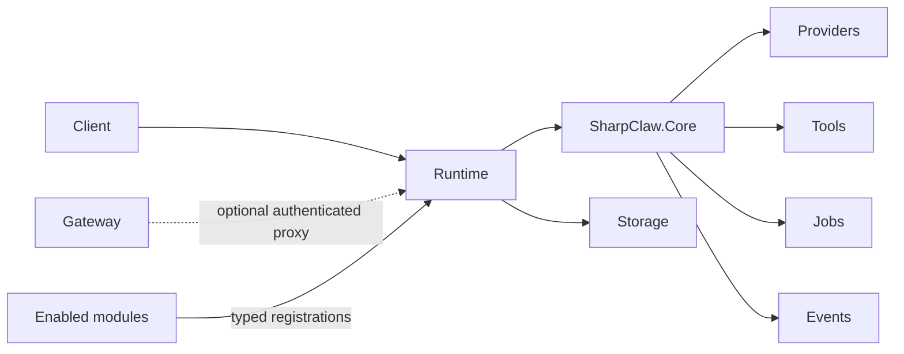

# SharpClaw

SharpClaw is a modular LLM runtime for .NET. Its deliberately small kernel handles model streaming, tools, canonical Jobs and Events, authenticated transport, module composition, logging, readiness, and durable storage. Product-specific behavior lives in optional modules, so an installation can start simple and grow without forking the kernel.

## Architecture At A Glance

SharpClaw compiles the host and every enabled module into one typed graph before it reports readiness. Clients call the Runtime directly or through the optional authenticated Gateway. The Runtime composes SharpClaw.Core with provider integrations, tools, Jobs, Events, and one configured persistence provider, while modules contribute only the services and capabilities they declare.



## Bring Your Own Features

A SharpClaw module uses public neutral contracts to declare what it supplies and requires. Before readiness, the host validates those relationships and grants only approved capabilities, so independently replaceable features still run through the same kernel paths.

| Area | Bring your own | What it enables |
| --- | --- | --- |
| **Kernel extensions** | Model providers and tools | Model backends, provider selection, model-visible tools, and typed handlers. |
|  | Actions, hooks, and events | Typed operations, interception, policy, tuning, observation, and event handling. |
|  | Durable work | Actions and tools that use canonical Jobs, progress, recovery, cancellation, and results. |
| **Authorization and permissions** | Authorization policy | One active `IAuthorizationPolicy` provider that makes allow-or-deny decisions. |
|  | Authorization consumers | Protected features that call the active policy through `RequireAuthorization`. |
|  | Authorization restrictions | Composable rules that may preserve or deny a decision, but can never grant authority. |
|  | Permission systems | Users, sessions, roles, clearances, resource grants, approvals, tenant rules, and their APIs or CLI commands. |
| **Feature systems** | Conversations and context | Threads, channels, history, conversation identity, chat profiles, and bounded prompt context. |
|  | Agents and knowledge | Agents, skills, memory, delegation, planning, and multi-step workflows. |
|  | Integrations and operations | Editor bridges, external services, metrics, logging integrations, and observability surfaces. |
| **Application and data** | Shared services | Typed exported and required contracts between declared modules. |
|  | Application surfaces | CLI commands and authenticated HTTP or WebSocket endpoints. |
|  | Storage | Host-managed documents, indexes, claims, and transactions, or module-owned EF Core contexts. |

## Storage

Install the storage module you need and select its provider key; the Runtime validates that contribution before readiness and never silently falls back.

| Module package | Provider key | Deployment notes |
| --- | --- | --- |
| `SharpClaw.Persistence.JSONColdStore` | `JSONColdStore` | Default local option; creates durable storage without a database server or migrations. The former `JsonFile` key remains an alias. |
| `SharpClaw.Persistence.PostgreSQL` | `PostgreSQL` | Set `ConnectionStrings__PostgreSQL` and apply the migrations owned by this module. The former `Postgres` key remains an alias. |
| `SharpClaw.Persistence.SQLServer` | `SQLServer` | For SQL Server, set `ConnectionStrings__SQLServer` and apply the migrations owned by this module. The former `SqlServer` key remains an alias. |
| `SharpClaw.Persistence.SQLite` | `SQLite` | Set `ConnectionStrings__SQLite` and apply the migrations owned by this module. |

## Getting Started

Download a packaged build from [SharpClaw releases](https://github.com/SharpClaw-NET/SharpClaw/releases), or build the repository with the .NET SDK selected by `global.json` using the commands below. Configure one enabled provider and model in the Runtime environment, use **Chat** for model requests, and use **Settings** to manage the Runtime endpoint and optional Gateway process; install optional packages only for the conversation state, authorization, agent workflows, or integrations your application needs.

```powershell
dotnet restore SharpClaw.slnx
dotnet build SharpClaw.slnx -c Release --no-restore
```

## Documentation

Start with the [kernel architecture specification](docs/SharpClaw-Kernel-Architecture-Specification.md) for product ownership and module boundaries, then use [database configuration](docs/Database-Configuration.md), the [Core API](docs/Core-API-documentation.md), [Core CLI](docs/Core-CLI-documentation.md), [Gateway](docs/Gateway-documentation.md), [logging](docs/Logging.md), and [provider parameters](docs/Provider-Parameters.md) for the corresponding operating surfaces.

## License And Security

SharpClaw is licensed under the [GNU Affero General Public License version 3 or later](LICENSE.md), subject to the exceptions stated in the license file. Report vulnerabilities privately through [GitHub Security Advisories](https://github.com/SharpClaw-NET/SharpClaw/security/advisories/new) rather than opening a public issue.
