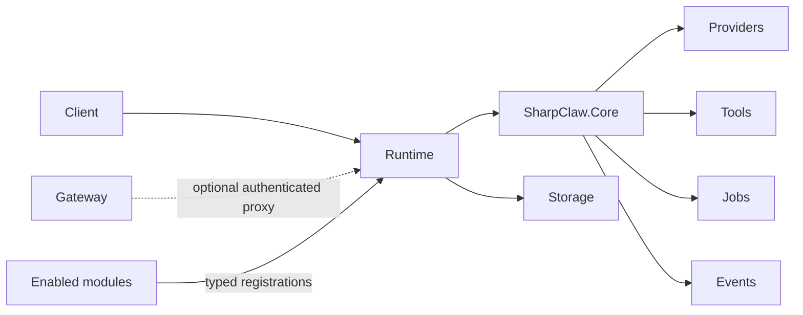

# SharpClaw

SharpClaw is a modular LLM runtime for .NET. Its deliberately small kernel handles model streaming, tools, canonical Jobs and Events, authenticated transport, module composition, logging, readiness, and durable storage. Product-specific behavior lives in optional modules, so an installation can start simple and grow without forking the kernel.

## What You Get By Default

A default installation lets you select a provider and model, then send independent requests through one explicit execution path. SharpClaw owns provider and model selection, streaming, tool execution, canonical Jobs and Events, module lifecycle, and the universal action graph. It deliberately does not create agents, permissions, channels, threads, memory, or conversation history; those features appear only when an enabled module supplies them.

## Architecture At A Glance

SharpClaw compiles the host and every enabled module into one typed graph before it reports readiness. Clients call the Runtime directly or through the optional authenticated Gateway. The Runtime composes SharpClaw.Core with provider integrations, tools, Jobs, Events, and one configured persistence provider, while modules contribute only the services and capabilities they declare.



## Modules And Capabilities

Each module adds declared capabilities to the same compiled graph instead of replacing the kernel or opening a parallel execution path. Providers connect model backends, tools expose model-visible operations, and context, authorization, or agent modules can layer in stateful conversations, policy, memory, skills, and workflows. Application and integration modules can expose CLI commands, authenticated HTTP or WebSocket endpoints, editors, external services, and observability surfaces.

## Bring Your Own Features

A SharpClaw module uses public neutral contracts to declare what it supplies and what it requires. Before startup, the host validates those relationships and grants only the approved capabilities. Extension points cover services, providers, tools, actions, hooks, events, durable Jobs, storage, prompt context, and application surfaces, all connected to the same kernel paths so a feature remains independently replaceable without becoming host-specific code.

## Storage

SharpClaw uses one configured persistence path for both kernel and module data. The default `JsonFile` provider uses JSONColdStore and creates durable local storage without a separate database service or setup step, while PostgreSQL, SQL Server, and SQLite use the same Entity Framework Core boundary for relational deployments; the Runtime validates the selected provider before publishing readiness and never silently falls back when that provider fails.

## Getting Started

Download a packaged build from [SharpClaw releases](https://github.com/SharpClaw-NET/SharpClaw/releases), or build the repository with the .NET SDK selected by `global.json` using the commands below. Configure one enabled provider and model in the Runtime environment, use **Chat** for model requests, and use **Settings** to manage the Runtime endpoint and optional Gateway process; install optional packages only for the conversation state, authorization, agent workflows, or integrations your application needs.

```powershell
dotnet restore SharpClaw.slnx
dotnet build SharpClaw.slnx -c Release --no-restore
```

## Documentation

Start with the [kernel architecture specification](docs/SharpClaw-Kernel-Architecture-Specification.md) for product ownership and module boundaries, then use [database configuration](docs/Database-Configuration.md), the [Core API](docs/Core-API-documentation.md), [Core CLI](docs/Core-CLI-documentation.md), [Gateway](docs/Gateway-documentation.md), [logging](docs/Logging.md), and [provider parameters](docs/Provider-Parameters.md) for the corresponding operating surfaces.

## License And Security

SharpClaw is licensed under the [GNU Affero General Public License version 3 or later](LICENSE.md), subject to the exceptions stated in the license file. Report vulnerabilities privately through [GitHub Security Advisories](https://github.com/SharpClaw-NET/SharpClaw/security/advisories/new) rather than opening a public issue.
